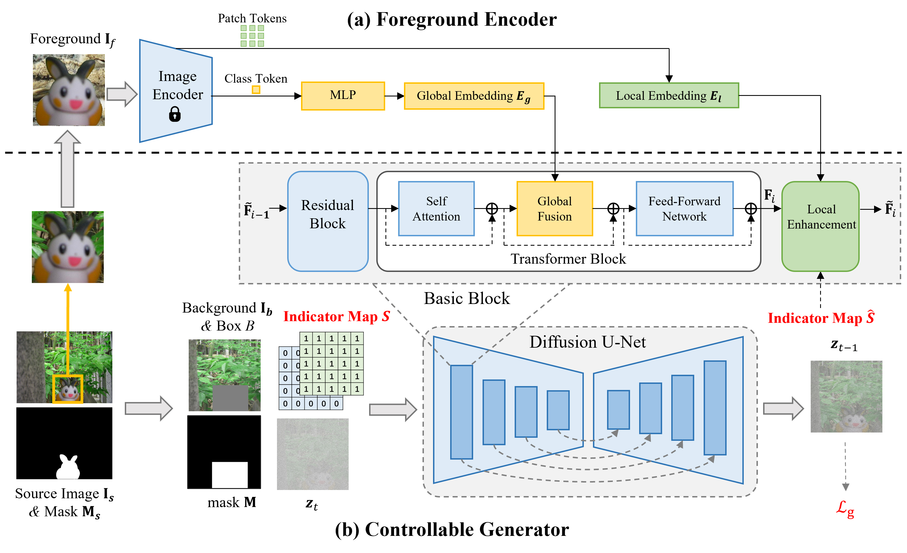

# Controllable Image Composition

Controllable image composition unifies multiple image composition sub-tasks (*i.e.*, image blending and image harmonization) into one generative model with a binary indicator variable to decide the sub-task, by using the following method. Image blending aims to insert the foreground object into the specified bounding box on the background seamlessly, while image harmonization further adjusts the foreground illumination to be compatible with the background. Given a foreground image containing foreground object, the foreground mask is optional, but providing foreground mask may improve the performance. Note that this model does not change the pose/viewpoint of foreground. This model works well in most cases and can maintain delicate details. 

> **ControlCom: Controllable Image Composition using Diffusion Model**  [[arXiv]](https://arxiv.org/pdf/2308.10040.pdf) [[code]](https://github.com/bcmi/ControlCom-Image-Composition) 
>
> Bo Zhang, Yuxuan Duan, Jun Lan, Yan Hong, Huijia Zhu, Weiqiang Wang, Li Niu 

## Brief Method Summary

### ControlCom
Controllable Composition (ControlCom) is built on pretrained stable diffusion, which takes masked background and noisy latent image as input. A foreground encoder extracts foreground features, which are injected into stable diffusion. Moreover, ControlCom introduces a binary indicator variable to indicate whether the foreground illumination should be changed. 0 indicates that the foreground illumination is not changed, corresponding to image blending task. 1 indicates that the foreground illumination is changed to match the background, corresponding to image harmonization task. In this way, ControlCom unifies these two tasks in one model.
