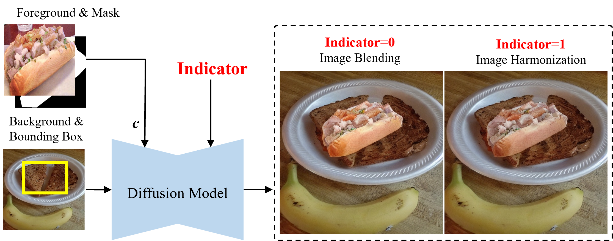

# Controllable Image Composition

Controllable image composition unifies multiple image composition sub-tasks into one generateive model. Here we adopt the following method:

**ControlCom**:

> **ControlCom: Controllable Image Composition using Diffusion Model**  [[arxiv]](https://arxiv.org/pdf/2308.10040.pdf) [[homepage]](https://github.com/bcmi/ControlCom-Image-Composition) 
>
> Bo Zhang, Yuxuan Duan, Jun Lan, Yan Hong, Huijia Zhu, Weiqiang Wang, Li Niu 

## Brief Method Summary

### ControlCom

Controllable Composition (ControlCom) unifies four tasks in one model using an 2-dim binary indicator vector, in which the first (resp., second) dimension represents whether adjusting the foreground illumination (resp., pose) to be compatible with background. 1 means making adjustment and 0 means remaining the same. Therefore, (0,0) corresponds to image blending, (1,0) corresponds to image harmonization, (0,1) corresponds to view synthesis, (1,1) corresponds to generative composition. **The current implementation only supports image blending and image harmonization.**