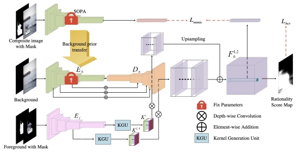

# FOPA Heatmap

Given a pair of foreground and background, the model predicts rationality heatmaps containing the rationality scores for all locations and scales by using the following method. The rationality score for each location and scale means the rationality of composite image obtained by placing the center of scaled foreground object at this location. Based on the rationality scores for all locations and scales, this model can output the optimal bounding boxes to place the foreground. 

> **Fast Object Placement Assessment** [[arXiv]](https://arxiv.org/pdf/2205.14280.pdf) [[code]](https://github.com/bcmi/FOPA-Fast-Object-Placement-Assessment)   
>
> Li Niu, Qingyang Liu, Zhenchen Liu, Jiangtong Li  

## Brief Method Summary

FOPA model extracts foreground feature vector from scaled foreground object, and extracts background feature map from background image. The foreground feature vector interacts with each location on the background feature map through dynamic kernel to predict the rationality score at this location. Given the foreground of certain scale,  FOPA model can predict the rationality heatmaps for this scale. Given the foregrounds of different scales, FOPA model can predict the rationality heatmaps for different scales. Based on the predicted rationality heatmaps, FOPA model can output the optimal bounding boxes to place the foreground and further output the corresponding composite images. 
