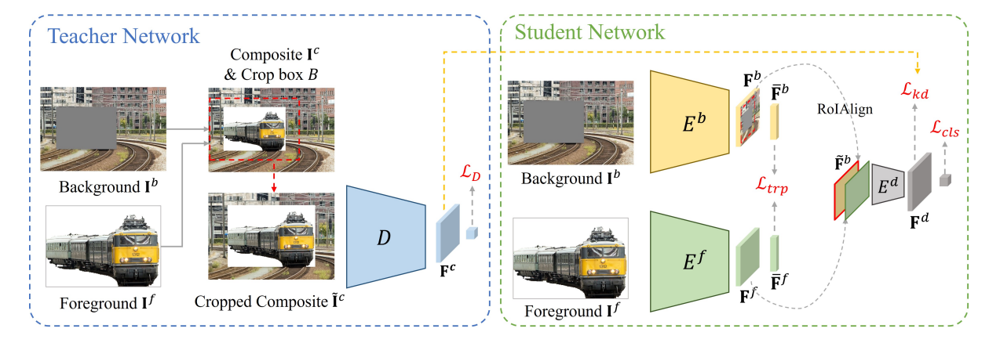

# Foreground Object Search (FOS) Score

The FOS score is computed by these two methods:

**FOS-E**:

> **Foreground Object Search by Distilling Composite Image Feature**  [[arXiv]](https://arxiv.org/pdf/2308.04990.pdf)[[code]](https://github.com/bcmi/Foreground-Object-Search-Dataset-FOSD) 
>
> Bo Zhang, Jiacheng Sui, Li Niu 
> Accepted by **ICCV 2023**.

**FOS-D**:

> **Learning a Discriminative Model for the Perception of Realism in Composite Images**  [[arXiv]](https://arxiv.org/abs/1510.00477)[[code]](https://github.com/junyanz/RealismCNN) 
>
> [Jun-Yan Zhu](https://www.cs.cmu.edu/~junyanz/), [Philipp Krähenbühl](https://www.philkr.net/), [Eli Shechtman](https://research.adobe.com/person/eli-shechtman/) and [Alexei A. Efros](https://people.eecs.berkeley.edu/~efros/) 
> Accepted by **ICCV 2015**.

## Brief Method Summary

### FOS-E

A novel FOS method via distilling composite feature (DiscoFOS). Specifically, a pretrained discriminator serves as teacher network. The student network employs two encoders to extract foreground feature and background feature. Their interaction output is enforced to match the composite image feature from the teacher network.

### FOS-D

Training a discriminator to estimate the compatibility of composite images.