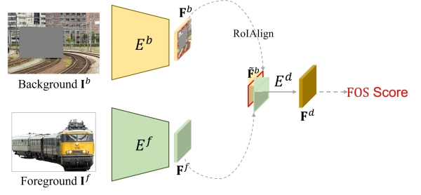
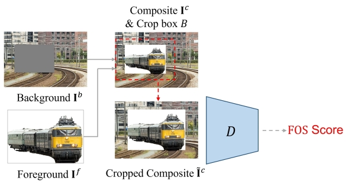

# Foreground Object Search (FOS) Score

FOS score measures the compatibility between foreground and background in terms of geometry and semantics, which is computed by using the following method. FOS score is useful for foreground object search, that is, retrieving compatible foregrounds from a foreground library for a given background with bounding box. 

> **Foreground Object Search by Distilling Composite Image Feature**  [[paper]](https://openaccess.thecvf.com/content/ICCV2023/papers/Zhang_Foreground_Object_Search_by_Distilling_Composite_Image_Feature_ICCV_2023_paper.pdf) [[code]](https://github.com/bcmi/Foreground-Object-Search-Dataset-FOSD) 
>
> Bo Zhang, Jiacheng Sui, Li Niu 
> Accepted by **ICCV 2023**.

## Brief Method Summary

### FOS-E

The foreground encoder extracts the foreground feature and the background encoder extracts the background feature. The interacted output feature is used to predict the compatibility score.

### FOS-D

A discriminator is used to predict the compatibility score based on the cropped composite image.
