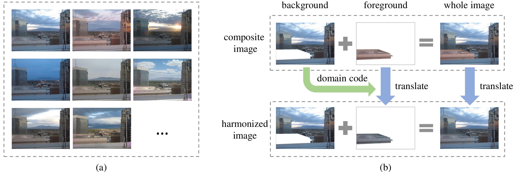

# Harmony Score Prediction

The harmony score of one composite image is computed by the following method:

**BargainNet**:

> **BargainNet: Background-Guided Domain Translation for Image Harmonization**  [[arxiv]](https://arxiv.org/abs/2009.09169) [[code]](https://github.com/bcmi/BargainNet-Image-Harmonization) 
>
> [Wenyan Cong](https://wenyancong.com/), [Li Niu](http://bcmi.sjtu.edu.cn/home/niuli/), [Jianfu Zhang](http://scholar.google.com/citations?user=jSiStc4AAAAJ&hl=zh-CN), Jing Liang, Liqing Zhang 
> Accepted by **ICME 2021**.

## Brief Method Summary

Given a composite image, we can extract the domain codes of foreground and background using BargainNet, and measure their similarity which is normalized within [0,1]. The normalized similarity score is referred to as harmony score. Larger harmony score implies more harmonious composite image. More details about BargainNet can be found in the [homepage](https://github.com/bcmi/BargainNet-Image-Harmonization).