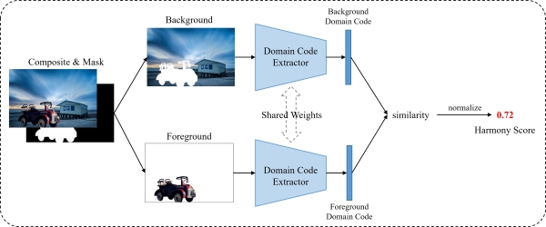

# Harmony Score Prediction

The harmony score measure the illumination compatibility between foreground and background, which is computed by the following method:

> **BargainNet: Background-Guided Domain Translation for Image Harmonization**  [[paper]](https://ieeexplore.ieee.org/document/9428394) [[code]](https://github.com/bcmi/BargainNet-Image-Harmonization) 
>
> Wenyan Cong, Li Niu, Jianfu Zhang, Jing Liang, Liqing Zhang 
> Accepted by **ICME 2021**.

## Brief Method Summary

Given a composite image, the domain code extractor extracts the domain codes of foreground and background, which encode the illumination information.  Then, the similarity between foreground domain code and background domain code is calculated and normalized within [0,1]. The normalized similarity score is referred to as harmony score, with larger harmony score implying more harmonious composite image. 
