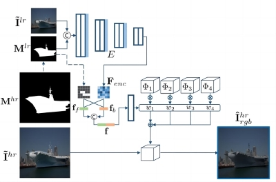
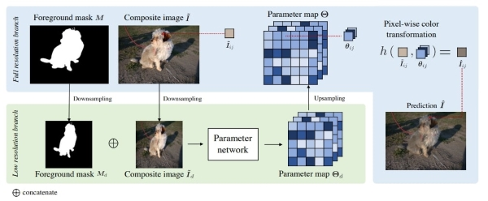

# Image Harmonization

Image harmonization is to harmonize a composite image by adjusting its foreground illumination to be consistent with the background. We provide two methods: CDTNet and PCTNet. Both methods are color-to-color transformation methods, that is, learning a color mapping to transform the composite foreground. Color-to-color transformation methods are efficient and applicable to an image with arbitrary resolution. CDTNet learns global color mapping while PCTNet learns local color mapping. The difference between "global" and "local" lies in whether applying different color mappings to different local regions. 

**CDTNet(sim)**:

> **High-Resolution Image Harmonization via Collaborative Dual Transformations**  [[pdf]](https://openaccess.thecvf.com/content/CVPR2022/papers/Cong_High-Resolution_Image_Harmonization_via_Collaborative_Dual_Transformations_CVPR_2022_paper.pdf)  [[code]](https://github.com/bcmi/CDTNet-High-Resolution-Image-Harmonization) 
>
> Wenyan Cong, Xinhao Tao, Li Niu, Jing Liang, Xuesong Gao, Qihao Sun, Liqing Zhang 
> Accepted by **CVPR2022**.

## Brief Method Summary

The original CDTNet combines pixel-to-pixel transformation and RGB-to-RGB transformation coherently in an end-to-end framework. Here, we only use the CDTNet(sim) model, which realizes pixel-to-pixel transformation. CDTNet(sim) employs an encoder, which takes in a downsampled image and outputs the image-specific coefficients to combine basis look-up tables (LUTs). The combined LUT is applied to the foreground region of full-resolution composite image. 

**PCTNet**:

> **PCT-Net: Full Resolution Image Harmonization Using Pixel-Wise Color
Transformations**  [[pdf]](https://openaccess.thecvf.com/content/CVPR2023/papers/Guerreiro_PCT-Net_Full_Resolution_Image_Harmonization_Using_Pixel-Wise_Color_Transformations_CVPR_2023_paper.pdf) [[code]](https://github.com/rakutentech/PCT-Net-Image-Harmonization) 
>
> Guerreiro, Julian Jorge Andrade and Nakazawa, Mitsuru and Stenger, Bj\"orn 
> Accepted by **CVPR2023**.

## Brief Method Summary

PCTNet takes in a downsampled image and outputs spatial-aware color transformation parameters,  which are interpolated and applied to the foreground region of full-resolution composite image. 
