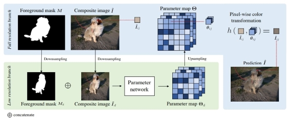

# Image Harmonization

Image harmonization aims to adjust the foreground illumination and color in a composite image so that it is consistent with the background.

`ImageHarmonizationModel` now supports **two backends**:

- **PCTNet**: fast pixel-wise color transformation, suitable for most regular harmonization tasks.
- **LBM**: diffusion-based harmonization backend with controllable inference steps and resolution.

**PCTNet**:

> **PCT-Net: Full Resolution Image Harmonization Using Pixel-Wise Color
Transformations**  [[pdf]](https://openaccess.thecvf.com/content/CVPR2023/papers/Guerreiro_PCT-Net_Full_Resolution_Image_Harmonization_Using_Pixel-Wise_Color_Transformations_CVPR_2023_paper.pdf) [[code]](https://github.com/rakutentech/PCT-Net-Image-Harmonization)<br>
>
> Guerreiro, Julian Jorge Andrade and Nakazawa, Mitsuru and Stenger, Bj\"orn<br>
> Accepted by **CVPR2023**.

## Brief Method Summary



PCTNet takes in a downsampled image and outputs spatial-aware color transformation parameters, which are interpolated and applied to the foreground region of full-resolution composite image.

## API

```python
from libcom.image_harmonization import ImageHarmonizationModel

model = ImageHarmonizationModel(device=0, model_type='PCTNet')
result = model(composite_image, composite_mask)
```

### Supported `model_type`

- `PCTNet`
- `LBM`

### LBM-specific inference kwargs

When `model_type='LBM'`, you can pass extra parameters in `__call__`:

- `steps` (int, default: `4`): diffusion sampling steps.
- `resolution` (int, default: `1024`): square inference size before resizing result back to original image size.

Example:

```python
from libcom.image_harmonization import ImageHarmonizationModel

model = ImageHarmonizationModel(model_type='LBM')
result = model(composite_image, composite_mask, steps=4, resolution=1024)
```

## Input / Output

- **Input**
  - `composite_image`: `str` path or `numpy.ndarray` (BGR image).
  - `composite_mask`: `str` path or `numpy.ndarray` mask indicating foreground region.
- **Output**
  - Harmonized image in `numpy.ndarray` (BGR format).
