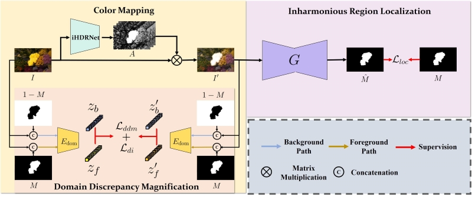

# Inharmonious Region Localization

Inharmonious region localization aims to localize the inharmonious region in a synthetic image, by using the following method. The inharmonious region means that the illumination of this region is not compatible with the other regions. Note that even for a real image, this model may still predict a relatively inharmonious region. 

> **Inharmonious Region Localization by Magnifying Domain Discrepancy** [[pdf]](https://ojs.aaai.org/index.php/AAAI/article/view/20048) [[code]](https://github.com/bcmi/MadisNet-Inharmonious-Region-Localization) 
>
> Jing Liang, Li Niu, Penghao Wu, Fengjun Guo, Teng Long  
> Accepted by **AAAI2022**.

## Brief Method Summary

MadisNet is a two-stage framework which can accomodate any localization network. In the first stage, the input image is converted to another color space to magnify the domain discrepancy between inharmonious region and background region, in which the color mapping is predicted by extended HDRNet. In the second stage, an arbitrary localization network is used to predict the inharmonious region mask based on the converted image. 
