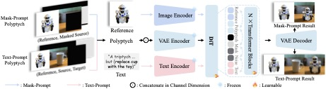

# Insert Anything

Insert Anything is a flux-based image composition method that supports inserting a single foreground reference image into a background. The composition image demonstrates strong capability in preserving foreground details.

> **Insert Anything: Image Insertion via In-Context Editing in DiT**  [[paper]](https://arxiv.org/pdf/2504.15009) [[code]](https://github.com/song-wensong/insert-anything) 
>
> Song, Wensong and Jiang, Hong and Yang, Zongxing and Quan, Ruijie and Yang, Yi 

## Brief Method Summary

Insert Anything is a unified image insertion framework built on the Diffusion Transformer (DiT). It concatenates the reference and target images into a diptych (for mask guidance) or triptych (for text guidance), encodes them with a frozen VAE, and lets DiT’s multimodal attention perform context-aware editing. The object in the reference image is converted into visual tokens that, together with the mask or text prompt, guide the model to generate a naturally blended result.
