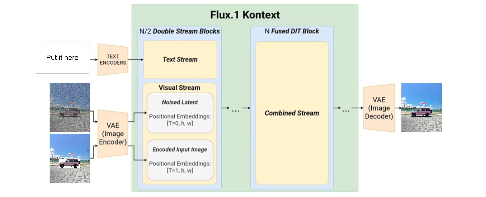

# KontextBlendingHarmonization
Image harmonization is to harmonize a composite image by adjusting its foreground illumination to be consistent with the background. Image blending is the process of seamlessly combining a foreground object with a background so that the composite appears natural and visually coherent.
Based on FLUX.1 Kontext, we provide these two models named KontextBlendingHarmonization.

> **FLUX.1 Kontext: Flow Matching for In-Context Image Generation and Editing in Latent Space**  [[paper]](https://arxiv.org/abs/2506.15742)  
>
> Black Forest Labs, Stephen Batifol, Andreas Blattmann, Frederic Boesel, Saksham Consul, Cyril Diagne, Tim Dockhorn, Jack English, Zion English, Patrick Esser, Sumith Kulal, Kyle Lacey, Yam Levi, Cheng Li, Dominik Lorenz, Jonas Müller, Dustin Podell, Robin Rombach, Harry Saini, Axel Sauer, Luke Smith 

## Brief Method Summary

FLUX.1 Kontext is a unified image generation and editing framework built on the Flux Transformer. It accepts text prompts together with one or more reference images, encoding them into a shared latent space via a frozen VAE. Its multimodal attention modules align the textual and visual contexts, enabling localized edits or full-scene generation in a context-aware manner. Reference images are converted into visual tokens that preserve character identity, object style, and spatial layout, guiding the model to produce coherent and consistent results.

Based on FLUX.1 Kontext, we train LoRA adapters and obtain two models for image blending and image harmonization.