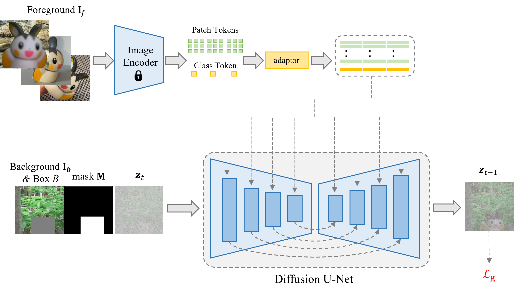

# Multi-Reference Object Stitch

MureObjectStitch is a simple extension of ObjectStitch to support multiple reference images of one foreground object. Generally, more reference images could lead to better results. MureObjectStitch is good at common or simple objects, but weak in keeping the object identity for the objects with rich details. If you have a few images containing the foreground object, we suggest finetuning MureObjectStitch using these images, which can greatly promote the detail preservation.

> **ObjectStitch: Object Compositing with Diffusion Model**  [[paper]](https://openaccess.thecvf.com/content/CVPR2023/papers/Song_ObjectStitch_Object_Compositing_With_Diffusion_Model_CVPR_2023_paper.pdf) [[code]](https://github.com/bcmi/ObjectStitch-Image-Composition) 
>
> Yizhi Song, Zhifei Zhang,  Zhe Lin, Scott Cohen, Brian Price, Jianming Zhang, Soo Ye Kim, Daniel Aliaga 
> Accepted by **CVPR 2023**.

## Brief Method Summary

### 

The framework of Object Stitch consists of a content adaptor and a generator (a pretrained text-to-image diffusion model). The input subject is fed into a ViT and the adaptor which produces a descriptive embedding. At the same time the background image is taken as input by the diffusion model. At each iteration during the denoising stage, we apply the mask on the generated image, so that the generator only denoises the masked area.

Following ObjectStitch, our implementation is based on [Paint-by-Example](https://github.com/Fantasy-Studio/Paint-by-Example), utilizing masked foreground images and employing all class and patch tokens from the foreground image as conditional embeddings. The content adapter in ObjectStitch is implemented using five stacked Transformer blocks in our codebase. We adopt a similar data preparation pipeline to generate and augment training data.

ObjectStitch takes a single foreground image as input. We extend ObjectStitch to MureObjectStitch, which can take multiple foreground images as input. The class and patch tokens from all foreground images are used as conditional embeddings.
