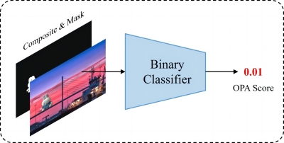

# Object Placement Assessment (OPA) Score Prediction

OPA score measures whether a composite image is plausible in terms of the foreground object placement, which is predicted by the following method:

> **OPA: Object Placement Assessment Dataset**  [[arXiv]](https://arxiv.org/pdf/2107.01889.pdf) [[code]](https://github.com/bcmi/Object-Placement-Assessment-Dataset-OPA) 
>
> Liu Liu, Zhenchen Liu, Bo Zhang, Jiangtong Li, Li Niu, Qingyang Liu, Liqing Zhang 

## Brief Method Summary

SimOPA is a binary classifier that is trained to distingush between reasonable and unreasonable object placements. Given a composite image and its foreground mask, SimOPA takes in their concatenation and predicts a rationality score. The score ranges from 0 to 1, where a larger score indicates more reasonable placement. 
