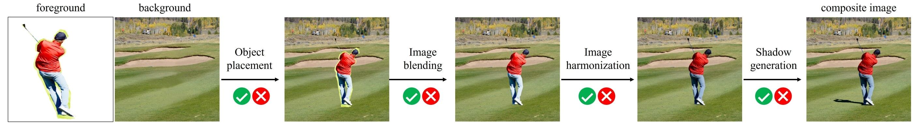

# OVERVIEW

This chapter introduces you to the **libcom** toolbox, and provides links to the detailed tutorials.

## Introduction

**_libcom_ is an image composition toolbox.** The goal of image composition is inserting one foreground into a background image to get a realistic composite image, by addressing the inconsistencies (appearance, geometry, and semantic inconsistency) between foreground and background. Generally speaking, image composition could be used to combine the visual elements from different images.

**_libcom_ covers a diversity of related tasks in the field of image composition**, including image blending, standard/painterly image harmonization, shadow generation, object placement, generative composition, quality evaluation, *etc*. For each task, we integrate one or two selected methods considering both efficiency and effectiveness. The selected methods will be continuously updated upon the emergence of better methods. 

**The ultimate goal of this library is solving all the problems related to image composition with simple `import libcom`.**

### Main Functions

- **get_composite_image** generates composite images using naive copy-and-paste followed by image blending.
- **OPAScoreModel**  evaluates the rationality of foreground object placement in a composite image.
- **FOPAHeatMapModel** can predict the rationality scores for all locations/scales given a background-foreground pair, and output the composite image with optimal location/scale.  
- **color_transfer** adjusts the foreground color to match the background using traditional color transfer method.
- **ImageHarmonizationModel** adjusts the foreground illumination to be compatible the background given photorealistic background and photorealistic foreground.
- **PainterlyHarmonizationModel** adjusts the foreground style to be compatible with the background given artistic background and photorealistic foreground.
- **HarmonyScoreModel** evaluates the harmony level between foreground and background in a composite image.
- **InharmoniousLocalizationModel** localizes the inharmonious region in a synthetic image.
- **FOSScoreModel** evaluates the compatibility between foreground and background in a composite image in terms of geometry and semantics.
- **ControlComModel** is a generative image composition model, which unifies image blending and image harmonization in one diffusion model. 
- **ShadowGenerationModel** generates plausible shadow for the inserted object in a composite image. 

## How to Use this Guide

Here is a detailed step-by-step guide to learn more about libcom:

1. For installation instructions, please see [get_started](https://libcom.readthedocs.io/en/latest/get_started.html).

2. Learn the usage of libcom by refering to [API Reference](https://libcom.readthedocs.io/en/latest/api.html).
