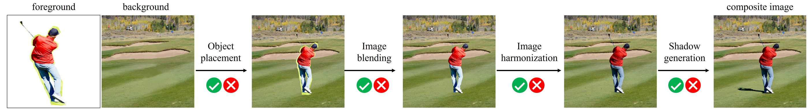

# OVERVIEW

This chapter introduces you to the libcom toolbox, and provides links to detailed tutorials about libcom.

## Introduction

libcom is an image composition toolbox covering various related tasks, including:

- **get_composite_image** generates composite images using naive copy-and-paste.
- **OPAScoreModel** is an object placement assessment model that evaluates the rationality of object placement by predicting a rationality scores.
- **FOPAHeatMapModel** can predict the rationality scores for all locations with a pair of background and scaled foreground as input in a single forward pass.
- **color_transfer** tranfers the color of foreground to background using reinhard algorithm.
- **ImageHarmonizationModel** contains several pretrained models for image harmonization, which aims to adjust
the illumination statistics of foreground to fit background.
- **PainterlyHarmonizationModel** contains serveral pretrained models for painterly image harmonization, which aims to adjust the foreground style of the painterly composite image to make it compatible with the background.
- **HarmonyScoreModel** predicts harmony score for a composite image, in which larger harmony score implies more harmonious composite image.
- **InharmoniousLocalizationModel** aims to localize the inharmonious region in a synthetic image.
- **FOSScoreModel** contains two foreground object search models, which can be used to evaluate the compatibility between foreground and background in terms of geometry and semantics.
- **ControlComModel** is a controllable image composition model, which unifies image blending and image harmonization in one diffusion model. 

## How to Use this Guide

Here is a detailed step-by-step guide to learn more about MMDetection:

1. For installation instructions, please see [get_started](get_started.md).

2. Refer to the below tutorials for the basic usage of MMDetection.

   - [Train and Test](https://mmdetection.readthedocs.io/en/latest/user_guides/index.html#train-test)

   - [Useful Tools](https://mmdetection.readthedocs.io/en/latest/user_guides/index.html#useful-tools)

3. Refer to the below tutorials to dive deeper:

   - [Basic Concepts](https://mmdetection.readthedocs.io/en/latest/advanced_guides/index.html#basic-concepts)
   - [Component Customization](https://mmdetection.readthedocs.io/en/latest/advanced_guides/index.html#component-customization)

4. For users of MMDetection 2.x version, we provide a guide to help you adapt to the new version. You can find it in the [migration guide](./migration/migration.md).