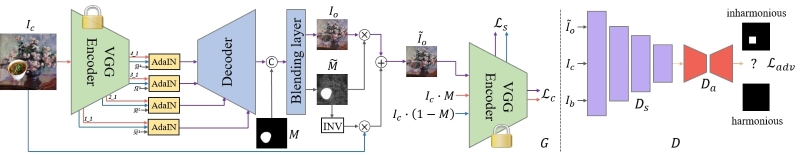
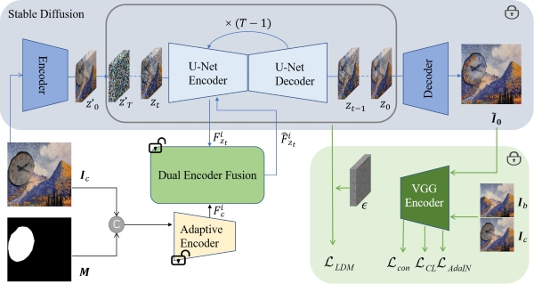

# Painterly Image Harmonization

Painterly image harmonization aims to harmonize the inserted foreground in an artistic background. Note that the difference between standard image harmonization and painterly image harmonization lies in whether the background is photorealistic or artistic. We provide the following two methods: PHDNet and PHDiffusion. PHDNet can generally achieve satisfactory performance with fast speed. For the challenging artistic backgrounds with dense textures or abstract styles, PHDiffusion could achieve better performance with slower speed. 

**PHDNet**:

> **Painterly Image Harmonization in Dual Domains**  [[paper]](https://ojs.aaai.org/index.php/AAAI/article/view/25099)[[code]](https://github.com/bcmi/PHDNet-Painterly-Image-Harmonization) 
>
> Junyan Cao, Yan Hong, Li Niu 
> Accepted by **AAAI 2023**.

## Brief Method Summary

The original PHDNet harmonizes the composite image in both spatial and frequency domain. Here, we remove the frequency-related modules for faster speed, so the model only harmonizes the composite image in the spatial domain. In the U-Net generator, AdaIN is applied to multi-scale encoder feature maps to align the feature statistics between foreground feature map and background feature map. The discriminator is used to make the foreground indistinguishable from the background, which can help remove the artifacts. 

**PHDiffusion**:

> **Painterly Image Harmonization using Diffusion Model**  [[paper]](https://dl.acm.org/doi/10.1145/3581783.3612451)[[code]](https://github.com/bcmi/PHDiffusion-Painterly-Image-Harmonization) 
>
> Lingxiao Lu, Jiangtong Li, Junyan Cao, Li Niu, Liqing Zhang 
> Accepted by **ACMMM 2023**.

## Brief Method Summary

Painterly Harmonization Diffusion model (PHDiffusion) is built upon pretrained stable diffusion, with additional lightweight adaptive encoder and Dual Encoder Fusion (DEF) module. The adaptive encoder takes in composite image and foreground mask, providing conditional information for stable diffusion. The adaptive encoder and the DEF module first harmonize the foreground features within each encoder (U-Net encoder and adaptive encoder). Then, the harmonizes foreground features from both encoders are combined to guide the harmonization process. 
