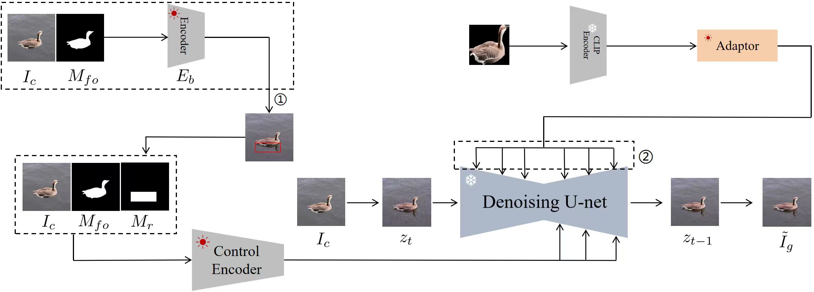

# Reflection Generation

Reflection generation model aims to generate plausible shadow for the inserted foreground in a composite image. The generated reflection can make the composite image more realistic. By using this model, the reflection geometry details (e.g., location, scale, shape) are generally correct.

> **Reflection Generation for Composite Image Using Diffusion Model**  [[code]](https://github.com/bcmi/Object-Reflection-Generation-Dataset-DEROBA)   
>

## Brief Method Summary

 
This model is built upon Stable Diffusion and trained on [DEROBA](https://github.com/bcmi/Object-Reflection-Generation-Dataset-DEROBA) dataset. In the first stage, the geometry encoder takes in the composite image and foreground mask to predict geometry priors which include rotated bounding box and shape embeddings information. In the second stage, the control encoder takes in the composite image, foreground mask and bounding box region mask to process the positional information, while the CLIP encoder takes in the cropped foreground object to process the foreground information. These features are injected into the U-Net through cross-attention layers for reflection generation. During testing, we add noise to the composite image to get the initial noise, which then goes through the denoising process to output the target image with foreground reflection.