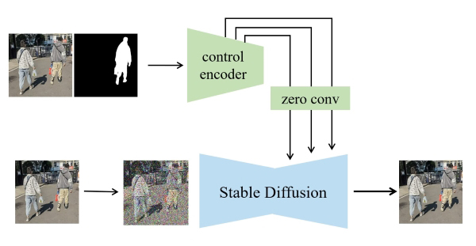

# Shadow Generation

Shadow generation model aims to generate plausible shadow for the inserted foreground in a composite image by using the following method ControlNet. The generated shadow can make the composite image more realistic. By using this model, the shadow direction and location are generally correct, but precise shadow shape is still a challenging goal. When the shadow shape is simple, it is very likely to get one satisfactory result from multiple outputs. 

> **Adding Conditional Control to Text-to-Image Diffusion Models**  [[paper]](https://openaccess.thecvf.com/content/ICCV2023/papers/Zhang_Adding_Conditional_Control_to_Text-to-Image_Diffusion_Models_ICCV_2023_paper.pdf) [[code]](https://github.com/lllyasviel/ControlNet) 
>
> Lvmin Zhang, Huijia Zhu, Anyi Rao, Maneesh Agrawala 
> Accepted by **ICCV 2023**.

## Brief Method Summary

This model is built upon [ControlNet](https://openaccess.thecvf.com/content/ICCV2023/papers/Zhang_Adding_Conditional_Control_to_Text-to-Image_Diffusion_Models_ICCV_2023_paper.pdf) and trained on [DESOBAv2](https://github.com/bcmi/Object-Shadow-Generation-Dataset-DESOBAv2) dataset. The control encoder takes in the composite image and foreground mask, providing conditional information for the pretrained stable diffusion. During testing, we add noise to the composite image to get the initial noise, which then goes through the denoising process to output the target image with foreground shadow. 
